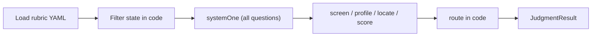

# judge-jev

**Private.** Jev-native judge kit for LLM outputs — skill, agents, core library, and CLI.

Architecture patterns from [CHECKLIST.md](./CHECKLIST.md) are enforced in `@judge-jev/core` from day one.

## Surfaces

| Surface | Path | Purpose |
|--------|------|---------|
| Core | `packages/core` | Rubric load → fan-out Jev call → funnel (`screen→profile→locate→score→route`) → `JudgmentResult` |
| CLI | `packages/cli` | `judge-jev run \| rubric \| replay` |
| Skill | `skills/judge-jev/SKILL.md` | Agent instructions for using the kit |
| Rubrics | `rubrics/` | Versioned YAML question packs (`assistant-reply`, `agent-trajectory`) |
| Agents | `agents/` | Charter stubs (`strict`, `product`, `safety`, `trajectory`) |
| Fixtures | `fixtures/` | Sample inputs + mock Jev responses (CI, no live API) |

## Quick start

```bash
npm install
npm run build
npm test

# Mock run (no TYPESAFE_API_KEY)
npm run judge-jev -- run \
  --rubric assistant-reply \
  --input fixtures/assistant-reply-pass.json \
  --mock
```

Live judging: set `TYPESAFE_API_KEY` and omit `--mock`.

## Core flow



- **Fan-out**: one `systemOne` call with every rubric question.
- **Pin**: `jev-1.13.0` (see `PINNED_JEV_MODEL`).
- **Log**: `model` + `usage` on each call.
- **Route**: confidence floors by stakes; Noul thresholds separate from Choice/Score confidence.

## Jaggedness

Jev performance is uneven across task shapes. When authoring rubrics:

- Prefer short, evidence-heavy state over long summaries.
- Rebuild Choice option lists from live catalogs; pre-filter in code.
- Re-tune thresholds when changing pinned model versions.

See TypeSafe’s jaggedness documentation when extending packs (paraphrase in rubric PRs; verify SDK fields against live docs).

## Development

```bash
npm run lint    # tsc -b
npm run test    # vitest (mock client only)
npm run build
```

## License

Proprietary — see [LICENSE](./LICENSE).
